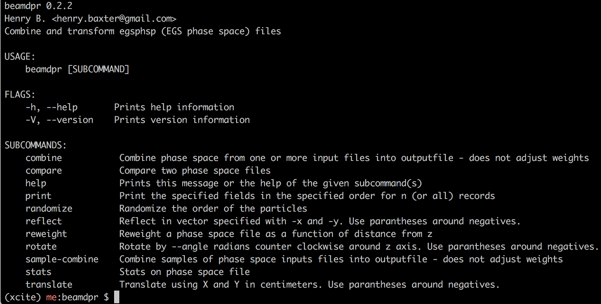

beamdpr
=======

Combine and transform egsphsp (EGS phase space) files.

.. image:: https://travis-ci.org/henrybaxter/beamdpr.svg?branch=master
    :target: https://travis-ci.org/henrybaxter/beamdpr

.. image:: https://img.shields.io/crates/v/beamdpr.svg
    :target: https://crates.io/crates/beamdpr

How it works
------------

.. code-block:: bash

    $ beamdpr translate -i first.egsphsp1 -x 2.3

Now ``first.egsphsp1`` has been translated 2.3 cm in the positive x direction.

Installation
============

Homebrew:

.. code-block:: bash

    brew tap henrybaxter/tap
    brew install beamdpr

Anything else:

1. Install rust for your system

    https://www.rust-lang.org/en-US/downloads.html

2. Install ``beamdpr`` using ``cargo``

    ``cargo install beamdpr``

3. All done. ``beamdpr`` should work. If not, `please file an issue! <https://github.com/henrybaxter/beamdpr/issues/new>`_

Usage
=====

Start by typing ``beamdpr`` at the terminal/command line. If that does not work, go back to the installation step. Still no dice? `Please file an issue! <https://github.com/henrybaxter/beamdpr/issues/new>`_

Combine
-------

Assume these are your files:

.. code-block:: bash

    $ ls
    first.egsphsp1 second.egsphsp1

Make a combined version:

.. code-block:: bash

    $ beamdpr combine *.egsphsp1 -o combined.egsphsp1

And there it is:

.. code-block:: bash

    $ ls
    combined.egsphsp1 first.egsphsp1 second.egsphsp1

**NOTE:** This will work with any number of files, as long as their mode matches. That means either they all have ZLAST or none of them do.

Sample-Combine
--------------

.. code-block: bash

    $ ls
    first.egsphsp1 second.egsphsp1

Take a sampling of 1 in 10 particles from each file

.. code-block:: bash

    $ beamdpr sample-combine *.egsphsp1 -o combined.egsphsp1 --rate 10
    $ du -sh *
    256K    first.egsphsp1
    256K    second.egsphsp1
    52K     combined.egsphsp1
    

Notice that we have divided the total space by 10.

Translate
---------

Let's assume this is your file:

.. code-block:: bash

    $ ls
    first.egsphsp1

Now translate it 23 in the x direction and -5.7 in the y:

.. code-block:: bash

    $ beamdpr translate first.egsphsp1 translated.egsphsp1 -x 23 -y (-5.7)

And there you have it :

.. code-block:: bash

    $ ls
    first.egsphsp1 translated.egsphsp1

**NOTE:** Negative numbers must have parantheses around them. You may omit an argument if you only want to translate in one direction.

Rotate
------

Let's assume this is your file:

.. code-block:: bash

    $ ls first.egsphsp1
    first.egsphsp1

Now rotate .9 radians in the counter-clockwise direction:

.. code-block:: bash

    $ beamdpr rotate first.egsphsp1 rotated.egsphsp1 --angle .9

It's all done!

.. code-block:: bash

    $ ls
    first.egsphsp1 rotated.egsphsp1

**NOTE:** If you rotate by 2π (6.28318530718) the file should be unchanged right? Not quite. Due to floating point vagaries there will be minor binary differences, but the value differences will be negligible.

Reflect
-------

Let's assume this is your file:

.. code-block:: bash

    $ ls first.egsphsp1
    first.egsphsp1

Now reflect around the vector (1, 0):

.. code-block:: bash

    $ beamdpr rotate first.egsphsp1 reflected.egsphsp1 -x 1

All set!

.. code-block:: bash

    $ ls
    first.egsphsp1 reflected.egsphsp1

**NOTE:** This effectively changed the sign of all y values and y directions.

In-place
--------

Any of these transform operations can be done **in-place** - that is, by modifying the input file, rather than creating a new one:

.. code-block:: bash

    $ ls first.egsphsp1
    first.egsphsp1

Reflect in the vector (-1, 0) in-place:

.. code-block:: bash

    $ beamdpr rotate first.egsphsp1 -i -x (-1)

**NOTE:** Negative numbers are input using parantheses, and ``-i`` is the same as ``--in-place``.

Delete after reading
--------------------

During a combine operation you may worry about disk space (10x10gb of phase space files could add another 100gb of combined phase space files). Let's delete as we go:

.. code-block:: bash

    $ ls
    first.egsphsp1 second.egsphsp1

So make a combined version:

.. code-block:: bash

    $ beamdpr combine *.egsphsp1 -o combined.egsphsp1 -d

.. code-block:: bash

    $ ls
    combined.egsphsp1

Help
====

Stuck? `Please file an issue! <https://github.com/henrybaxter/beamdpr/issues/new>`_
